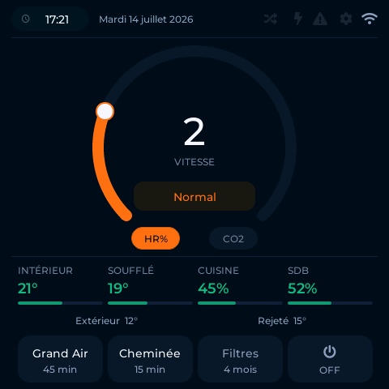
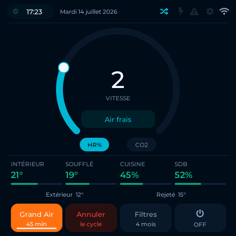
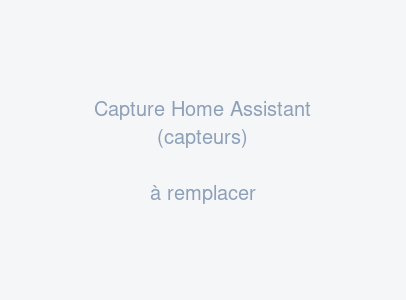
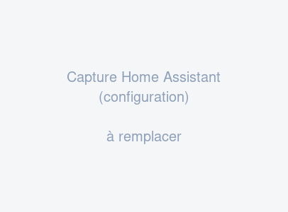
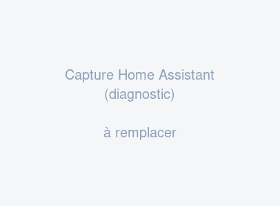

# ESPHome — Helios KWL / Vallox · Touch controller & Home Assistant

[🇫🇷 Français](README.fr.md) · **🇬🇧 English**

[](https://claude.ai/)
[](https://esphome.io/)
[](https://github.com/loicdugay/esphome-helios-kwl/releases)
[](LICENSE)

**The wall controller of my Helios heat-recovery ventilation unit died. Manufacturer replacement: ~€420.**
**This project replaces it with a ~€60 all-in-one board — that does a lot more.**

<p align="center">
  
</p>

One [LilyGO T-Panel S3](https://www.lilygo.cc/products/t-panel-s3) (ESP32-S3 + 480×480 touch screen + RS485 transceiver, all built in), the ventilation unit's DIGIT RS485 protocol decoded register by register, and you get:

- 🖐️ **A complete touch wall controller**: speed, modes, cycles, measurements, maintenance
- 🏠 **46 auto-discovered Home Assistant entities**: sensors, settings, diagnostics, history
- 🔍 **Verified communication**: every command sent to the unit is read back and confirmed in the logs
- 💶 **A ~€60 budget**, with no modification to the ventilation unit — the board plugs in parallel on the existing bus

> Based on the original work of [Cyril Jaquier](https://github.com/lostcontrol/esphome-helios-kwl) (KWL EC 500 R), taken all the way to a full replacement of the original controller: 40+ registers in read/write, Fireplace/Boost cycles, touch interface, write verification.

*Note: the entity names and on-screen labels are in French (it drives a French household 🌬️). Everything is customizable through the substitutions at the top of [`vmc.yaml`](vmc.yaml).*

---

## The touch interface

| Normal (winter) | Fresh air (summer) | Cycle running | Standby (OFF) |
|:---:|:---:|:---:|:---:|
|  |  |  |  |

### Screen quick guide

| Zone | Action |
|---|---|
| **Arc + knob** | Drag to set the fan speed **1-8**. The central digit shows the current speed. |
| **Central pill** (`Normal` / `Air frais`) | Toggles the seasonal mode. *Normal* (orange) = winter, heat recovery. *Air frais* (cyan) = summer, the bypass may open for free cooling. The whole screen adopts the mode color. |
| **`HR%`** | Enables automatic regulation by humidity: the unit modulates the speed between nominal and maximum on its own. |
| **`CO2`** | Enables automatic regulation by CO₂ (requires the optional sensor). |
| **Measurement grid** | Indoor/supply temperatures and room humidity. Colors follow **comfort** zones (French ADEME/ARS guidelines): green = comfort (19-26 °C, 40-60 %RH), amber = warm/dry, blue = cold/humid, red = too hot. |
| **`Grand Air`** | Boost ventilation at maximum speed for **45 min** (big cleaning, smelly cooking…). Countdown shown; the other button becomes `Annuler` (cancel). |
| **`Cheminée`** | Fireplace mode: stops extraction for **15 min** to avoid negative pressure when lighting a fire. |
| **`Filtres`** | Shows the months left before filter replacement. One press → `Confirmer ?` (30 s) → a second press resets the counter after you replaced the filters. |
| **`⏻`** | Turns the ventilation unit on/off. When off, the screen dims and only this button stays active. |
| **Top bar** | Time, date, and status icons: bypass open, defrosting, fault, filters, Wi-Fi. |
| **Sleep** | After 5 min without touch, the screen fully turns off (LCD anti-burn-in). A touch wakes it up with no risk of accidental press. |

For the ventilation unit itself: [Helios KWL EC 300 Pro manual](docs/helios-kwl-ec-300-pro-notice.pdf) (archived in this repository).

---

## In Home Assistant

All entities are auto-discovered and categorized (controls, sensors, configuration, diagnostics):

| Controls | Sensors |
|:---:|:---:|
|  |  |

| Configuration | Diagnostics |
|:---:|:---:|
|  |  |

Plenty to build automations and dashboards with: boost when the bathroom humidity crosses a threshold, switch to summer mode based on the weather, filter replacement alerts, heat-exchanger temperature tracking…

---

## Architecture & registers

### The 4 communication primitives

The component is built on **4 primitives**, strictly compliant with the Vallox DIGIT protocol:

| Primitive | Role |
|---|---|
| `loop_read_bus()` | Continuous passive listening of the RS485 bus in `loop()`. Intercepts mainboard broadcasts (temperatures, CO₂, …) and poll responses. Only publishes frames addressed to remote controls (`dst=0x20`) or to our address (`dst=0x2F`). |
| `read_register(reg)` | Robust poll: waits for bus silence (≥10 ms), sends a READ request, then parses the response **stream** — an interleaved broadcast is dispatched normally instead of failing the read. 3 attempts max (protocol §3.1). |
| `write_register(reg, val)` | Strict protocol write: 3 or 4 messages depending on the register (RC broadcast → mainboard broadcast → direct mainboard, doubled CRC on the last one), logged as `[CMD]`, then a **verification read-back** is scheduled on the next poll and logged as `[CM] ecriture confirmee` (or a warning if the mainboard returns a different value). |
| `write_bit(reg, bit, state)` | Single-bit modification based on the latest polled value (just like the physical remote), delegated to `write_register`. |

### Polling strategies

| Strategy | Frequency | Registers | Description |
|---|---|---|---|
| S1 — Passive | ~12s (mainboard broadcasts) | 0x2A-0x2C, 0x32-0x35 | Temperatures and CO₂ intercepted automatically |
| S2 — Cyclic | 6s | 0x29, 0xA3, 0x08, 0x71, 0x79, 0x6D, 0x2F, 0x30 | Unit state, speed, humidity, boost, alarms |
| S3 — Config | At boot then hourly | configuration registers | Setpoints, thresholds, intervals, modes |
| Temperature fallback | 60s | 0x32-0x35 | Safety net: broadcasts stop when the unit is off, while it still answers READs |

Polling tables are **built dynamically**: a register is only polled if a YAML entity consumes its value (zero useless bus traffic). S2/S3 alternate at a 5:1 ratio, with one extra S3 poll per second during the first 2 minutes after boot (all settings reach HA in ~20 s). A failed S3 poll is retried after 30 s instead of waiting for the next hour, and every write forces a read-back of the register on the next poll.

### Home Assistant entities

The full reference (every entity, its register, primitive and logic) is documented in [`docs/helios-kwl-referentiel-v7.md`](docs/helios-kwl-referentiel-v7.md) (French). Entity names below are the actual French HA names.

#### Sensors

| Entity | Type | Description | Register |
|---|---|---|---|
| Vitesse de ventilation | `sensor` | Current speed 1-8 | 0x29 |
| Température air extérieur | `sensor` (°C) | Outdoor NTC probe | 0x32 |
| Température air rejeté | `sensor` (°C) | Exhaust air NTC probe | 0x33 |
| Température air intérieur | `sensor` (°C) | Extract air NTC probe | 0x34 |
| Température air soufflé | `sensor` (°C) | Supply air NTC probe | 0x35 |
| Humidité capteur 1 | `sensor` (%) | %RH probe #1 | 0x2F |
| Humidité capteur 2 | `sensor` (%) | %RH probe #2 | 0x30 |
| Niveau CO₂ | `sensor` (ppm) | 16-bit CO₂ — *shipped commented out in vmc.yaml (requires the sensor)* | 0x2B+0x2C |
| Fin du cycle dans... | `sensor` (min) | Boost/fireplace time remaining | 0x79 |
| Prochain remplacement | `sensor` (months) | Maintenance countdown | 0xAB |
| Code de diagnostic | `sensor` | Last fault code | 0x36 |
| Gestion thermique (num) | `sensor` | 0=bypass closed, 1=bypass open | 0x08 bit 1 |
| Santé du Système | `sensor` | 0=OK, 1=filters, 2=fault | Aggregated |
| Cycle en cours (num) | `sensor` | 0=normal, 1=boost, 2=fireplace | 0x71+0xAA |

#### Text sensors

| Entity | Description |
|---|---|
| Détail du diagnostic | French translation of the fault code |
| Cycle en cours | "Normal" / "Cycle Plein Air" / "Cycle Cheminée" |
| Gestion thermique | "Air frais" / "Chaleur conservée" |

#### Binary sensors

| Entity | Register | Note |
|---|---|---|
| Auto-dégivrage | 0x08 bit 4 | Preheating active |
| Alerte Givre | 0x6D bit 7 | Heat exchanger freeze risk |
| Alerte CO₂ | 0x6D bit 6 | CO₂ > 5000 ppm — *shipped commented out in vmc.yaml* |
| État des filtres | 0xA3 bit 7 | Maintenance required |
| Appoint de chaleur | 0xA3 bit 5 | Post-heating LED |
| Ventilateur soufflage | 0x08 bit 3 | ⚠️ Inverted logic |
| Ventilateur extraction | 0x08 bit 5 | ⚠️ Inverted logic |
| Contact externe | 0x08 bit 6 | S terminals |
| Relais défaut | 0x08 bit 2 | ⚠️ Inverted logic |

#### Fan

| Entity | Description |
|---|---|
| Ventilation | Native ESPHome fan, ON/OFF + 8 speeds. Continuously synchronized with the real unit state through S2 polls of 0xA3 (power) and 0x29 (speed). Boot guard: ignores commands until the first 0xA3 poll arrives (~6s). |

#### Switches

| Entity | Primitive | Register |
|---|---|---|
| Gestion intelligente (CO₂) | `write_bit` | 0xA3 bit 1 |
| Gestion intelligente (%HR) | `write_bit` | 0xA3 bit 2 |
| Mode Fraîcheur | `write_bit` | 0xA3 bit 3 |

#### Numbers

| Entity | Primitive | Register | Range |
|---|---|---|---|
| Ventilation nominale | `write_register` | 0xA9 | 1-8 |
| Ventilation maximale | `write_register` | 0xA5 | 1-8 |
| Seuil de fraîcheur | `write_register` | 0xAF | 0-25°C |
| Seuil de dégivrage | `write_register` | 0xA7 | -6 to 15°C |
| Seuil Alerte Givre | `write_register` | 0xA8 | -6 to 15°C |
| Hystérésis antigel | `write_register` | 0xB2 | 1-10°C |
| Seuil CO₂ | `write_register` | 0xB3+0xB4 | 500-2000 ppm — *shipped commented out* |
| Seuil Humidité | `write_register` | 0xAE | 1-99% |
| Fréquence d'analyse | `write_bits_masked` | 0xAA bits 0-3 | 1-15 min |
| Ajustement Soufflage | `write_register` | 0xB0 | 65-100% |
| Ajustement Extraction | `write_register` | 0xB1 | 65-100% |
| Intervalle entretien | `write_register` | 0xA6 | 1-15 months |

#### Selects

| Entity | Primitive | Register |
|---|---|---|
| Cycle commande murale | `write_bit` | 0xAA bit 5 |
| Détection humidité | `write_bit` | 0xAA bit 4 |
| Ventilation maximale forcée | `write_bit` | 0xB5 bit 0 |

#### Buttons

| Entity | Write sequence |
|---|---|
| Cycle Plein Air | `write_bit(0xAA,5,true)` → `write_register(0x79,45)` → `write_bit(0x71,5,true)` |
| Cycle Cheminée | `write_bit(0xAA,5,false)` → `write_register(0x79,15)` → `write_bit(0x71,5,true)` |
| Arrêter le cycle | `write_register(0x79, 1)` — lets the unit finish naturally in ~1 min |
| Confirmer remplacement filtres | `read_register(0xA6)` → `write_register(0xAB, val)` |

---

## Compatible ventilation units

The component uses the DIGIT RS485 protocol, common to the whole range:

| Brand | Tested models | Status |
|--------|---------------|--------|
| **Helios** | KWL EC 300 Pro R | ✅ Tested |
| **Helios** | KWL EC 500 R | ✅ Tested (original author) |
| **Vallox** | Digit SE / Digit 2 SE | ⚠️ Compatible (same protocol, untested) |

All "previous generation" Helios KWL models (without built-in Ethernet) are compatible. Recent models with Ethernet / easyControls use a different protocol and are **not** compatible.

---

## Hardware — LilyGO T-Panel S3

This project uses the [LilyGO T-Panel S3](https://www.lilygo.cc/products/t-panel-s3), an all-in-one board with the ESP32-S3, a touch screen, an RS485 transceiver and 8 MB of PSRAM. No extra components required.

| Spec | Value |
|---|---|
| SoC | ESP32-S3 (2× Xtensa LX7 cores, 240 MHz) |
| Screen | 480 × 480 pixels, parallel RGB, CST3240 capacitive touch |
| RS485 | Built-in transceiver (TX = GPIO16, RX = GPIO15) |
| PSRAM | 8 MB QSPI (80 MHz) |
| Flash | 16 MB |
| Power | 24V DC |

> **Warning:** On V1.2 and V1.3 boards, the RS485 and CAN pins are shared. Do not use both at the same time.

## Wiring

> ⚠️ **Disconnect the ventilation unit from mains power before any work on the terminals.**

The Helios KWL RS485 bus uses a 5-wire shielded cable `JY(ST)Y 2×2×0.6 mm² + 0.5 mm²`. The pinout is identical on the unit's junction box and on the Helios KWL-FB remote control:

```
RS485 terminal pinout (unit and remote control)
┌─────┬───────────┬──────────┬──────────────────────────────┐
│ Pin │ Color     │ Signal   │ Description                  │
├─────┼───────────┼──────────┼──────────────────────────────┤
│  1  │ Orange 1  │    +     │ +24V DC supply               │
│  2  │ White 1   │    −     │ Supply GND                   │
│  3  │ Orange 2  │    A     │ RS485 line A                 │
│  4  │ White 2   │    B     │ RS485 line B                 │
│  5  │ Grey      │    M     │ Signal ground (shield)       │
└─────┴───────────┴──────────┴──────────────────────────────┘
```

### Connecting to the T-Panel S3

```
Helios unit                         T-Panel S3
(junction box terminals)           (RS485 terminals)

  Pin 1  Orange 1  + ──────────── V
  Pin 2  White 1   - ──────────── G
  Pin 3  Orange 2  A ──────────── A (L)
  Pin 4  White 2   B ──────────── B (M)
  Pin 5  Grey      M ──────────── GND (DGND)
```

The T-Panel connects in parallel with the existing Helios KWL-FB remote control. The RS485 bus supports up to 32 devices.

> **Tip:** If communication doesn't work, try swapping A and B. Naming conventions vary between transceiver manufacturers.

---

## Installation

The recommended way: **start from [`vmc.yaml`](vmc.yaml)**, the complete working example for the T-Panel S3 (all entities + the touch interface + anti-burn-in sleep). Copy it into your ESPHome configuration, then:

**1. Create a `secrets.yaml` file:**
```yaml
wifi_ssid: "YourSSID"
wifi_password: "YourPassword"
api_key: "your-esphome-api-key"
ota_password: "your-ota-password"
ap_password: "fallback-password"
```

**2. Adjust the substitutions** at the top of the file (humidity probe room names, timezone), and uncomment the CO₂ entities if your unit has the sensor.

**3. Compile and flash.** Fonts are downloaded automatically at compile time from their official open-source origins (Montserrat via Google Fonts, native LVGL symbols) — no local files to install.

To integrate the component into an existing configuration (without the screen):

```yaml
external_components:
  - source:
      type: git
      url: https://github.com/loicdugay/esphome-helios-kwl/
    components: [helios_kwl]

uart:
  id: uart_bus
  tx_pin: 16
  rx_pin: 15
  baud_rate: 9600

helios_kwl:
  id: helios_kwl_0
  uart_id: uart_bus
  update_interval: 1s   # 1 poll per second (S2/S3 rotation)
```

---

## RS485 protocol — quick reference

### Frame structure (6 bytes)

```
┌────────┬────────┬──────────┬──────────┬──────┬──────────┐
│ SYSTEM │ SENDER │ RECEIVER │ VARIABLE │ DATA │ CHECKSUM │
│  0x01  │  0x2F  │  0x11    │  0x29    │ 0x1F │  0x8F    │
└────────┴────────┴──────────┴──────────┴──────┴──────────┘
```

| Field | Role |
|-------|------|
| SYSTEM | Always `0x01` |
| SENDER | `0x11`–`0x1F` mainboards · `0x21`–`0x2F` remote controls |
| RECEIVER | `0x10` all mainboards · `0x11` mainboard 1 · `0x20` all remotes |
| VARIABLE | `0x00` = read request, otherwise the register being written |
| DATA | Requested register (read) or written value |
| CHECKSUM | Sum of the previous 5 bytes, modulo 256 |

The full English translation of the specification lives in [`docs/vallox-digit-protocol-rs485.md`](docs/vallox-digit-protocol-rs485.md).

## Troubleshooting

| Symptom | Fix |
|----------|----------|
| Build fails with "IRAM overflow" | Add the `sdkconfig_options` (see below) |
| No response from the unit | Check A/B wiring (swap them) · enable `uart: debug:` |
| Inconsistent temperatures | Faulty unit probe — check register 0x36 |
| Write not confirmed (`[CM] ... la CM renvoie ...`) | Occasionally normal (volatile register). If systematic, check the wiring. |
| Fan flapping ON/OFF after power-off | Check `restore_mode: RESTORE_DEFAULT_OFF` in the YAML |
| Cycle button needs 2 presses | The previous cycle may not be finished. Press "Arrêter le cycle" first. |

**Freeing IRAM on ESP32-S3:**

ESP-IDF Kconfig options must go through `sdkconfig_options` — `-DCONFIG_*`
flags in `platformio_options` are silently ignored. Note: the memory report
always shows "IRAM 100%", which is normal — the linker fills the dedicated
16 KB IRAM segment first and overflows into DIRAM; the real headroom is on
the DIRAM line.

```yaml
esp32:
  framework:
    type: esp-idf
    sdkconfig_options:
      CONFIG_FREERTOS_PLACE_FUNCTIONS_INTO_FLASH: "y"
      CONFIG_RINGBUF_PLACE_FUNCTIONS_INTO_FLASH: "y"
      CONFIG_ESP_WIFI_IRAM_OPT: "n"
      CONFIG_ESP_WIFI_RX_IRAM_OPT: "n"
      CONFIG_LWIP_IRAM_OPTIMIZATION: "n"
```

---

## Credits

- **Cyril Jaquier** ([lostcontrol](https://github.com/lostcontrol/esphome-helios-kwl)) — original author, KWL EC 500 R
- **loicdugay** — T-Panel S3 fork, full read/write support of 40+ registers, boost/fireplace cycles, LVGL interface
- **Abeer Ash** ([ash-abeer](https://github.com/ash-abeer)) — initial adaptation of the original code to the T-Panel S3 hardware (including the CST3240 touch driver, since replaced by the native ESPHome `cst226` component), commissioned and funded by **loicdugay**
- **DIGIT protocol** — Vallox / Petteri Kähärä documentation (2011): [original specification (PDF, archived in this repo)](docs/Archive/vallox-digit-protocol-rs485.pdf) · [English translation (markdown)](docs/vallox-digit-protocol-rs485.md) · [FHEM Vallox wiki](https://wiki.fhem.de/wiki/Vallox) · [community copy (Symcon)](https://community.symcon.de/uploads/short-url/fp2ucSqkcPPBqQ4Lc2UWcsJr4Pn.pdf)

## ⚠️ Disclaimer — use at your own risk

This project is community work **provided "AS IS", without warranty of any kind**, express or implied, including but not limited to the warranties of merchantability, fitness for a particular purpose and non-infringement (see the [MIT license](LICENSE)).

**By using this project, you acknowledge and accept that:**

- You are working on **mains-powered ventilation equipment**. Always disconnect power before any wiring work. Hire a qualified professional if in doubt.
- Writing registers not documented by the manufacturer can **permanently damage your ventilation unit** (the Vallox specification explicitly forbids some registers — this component does not use them, but any modification of the code is your own responsibility).
- Using this project may **void the manufacturer's warranty** of your equipment.
- To the maximum extent permitted by applicable law, the authors and contributors **shall not be liable for any damages** — direct, indirect, incidental, consequential or special (equipment or installation damage, loss of use, replacement or repair costs, personal injury…) — arising from the use of, or inability to use, this software and its documentation, even if advised of the possibility of such damages.
- This is an **independent** project: it is not affiliated with, endorsed or supported by Helios Ventilatoren, Vallox Oy or LilyGO. All trademarks belong to their respective owners.

## License

Distributed under the [MIT](LICENSE) license. You are free to use, modify and redistribute it, provided the copyright notice is kept — and the warranty disclaimer above is an integral part of it.
